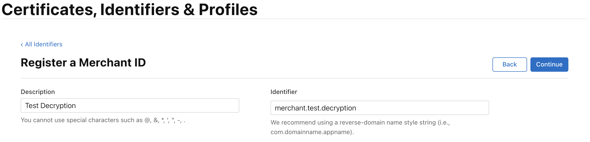
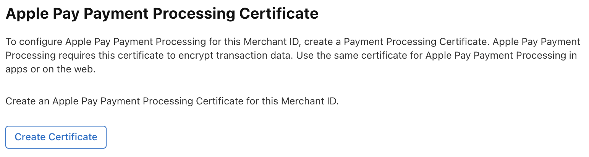

# apple-pay-decrypt
A simple app demonstrating decryption of payment data from an Apple Pay payment token.

## Apple Pay payment data

On [authorization](https://developer.apple.com/documentation/applepayontheweb/applepaysession/onpaymentauthorized) via the payment sheet, Apple will return a [`payment`](https://developer.apple.com/documentation/applepayontheweb/applepaypayment) object.

Within this is a [`token`](https://developer.apple.com/documentation/applepayontheweb/applepaypaymenttoken) object, alongside optional plaintext `billingContact` and `shippingContact` information (if collected).

Within the `token` object is some plaintext `paymentMethod` data, a unique `transactionIdentifier` and, critically, a [`paymentData`](https://developer.apple.com/documentation/passkit/payment-token-format-reference#Payment-token-format-reference) object which contains the encrypted data required for payment processing.

`paymentData` looks like this:
``` js
{
    data: "7PqdOQ0Yt/GYhD628NXzXWQvEaN2ack1VYXlYQ4V3GS8jk+Y4UAzKhrrgUEByxQJMs6nv0i7WnfR1g0N9CxzdmsgLkpDN8WHjk5EWZIEeHAlUVTtMLbt7JslAfCFCXWgZiFhdYxqeAZkmnJJo1M/0YMqOwnF/ftafV4jaRGnIwIqDjBldapzHlATLcjpWHAh2qZK6JMQBfhIyjdFbLrVJlBU8ldy9y/Jzavu3eHJZI4QXNKGLdECRHP1F0RmjPoSvIU2IzcnKUCvcHpu4Oa5tQWFxuf7GG2q7KBbIrgmVLD3eF1Fj2iX4hoNpgMxVS5LwNnfi3AjsWCOshjmIyoWChESeJlq+0DFl6hu1Y0QxgyaytKHDmWJxEFboHMrXScPlYBKHBb9hxHwiWwI2qQNOf0PKHUyZeWPronrY0QXJUh1EXcyfrUmkq82wd8PcXpm4REp/i7r5IhCrZGsz3FEXrqfc72DWLFJRUnaICUBExXl9N9TaJefisXzwHQR6FmlU1MTqub9fT59+Wr1vizFYerU+lPs/rkCf1C+u0nAl3XDUede5R+ltKEzlrc/qaFEj2r5c138q2TapjFLdF4gTHPqkIp0gt9r0El+8S2r06UxjnduIVYuzmLtBchc/b4eYX36mgTysDb2qBBtfCfqeh3loSc4+eKSbbWqS3241bx2Ht2lFGP/dodrcZdKtLd2p7zI0/lK7B8USFjqLix5mwsqOArSgzd4m22w0GWa5ufSVbpNeCfgQ8mp2sFUNU/NpFb1UDiwsr8KsIxpHnLVoEgHUv0DSO5fnEGv6LsH157DlpvDWMUM6H+uk8zWPpq2LENrUTDlx8BwKqWJlfRbuL3vwDOXZBI4M+8KPmklE98reXHM5n2ZaBAJQ+JsDbnaRxVZ7cXdyc0y0IcF8TNc1Pk24Zk7dnQOr9+oS5pDQ5hN2NzWB0tw8Tjc+Enjrh3RxfzbegtkdW3sCi8clj/XUK6wd7wyVgdMI9au/TOijReCv3HZ",
    signature: "MIAGCSqGSIb3DQEHAqCAMIACAQExDTALBglghkgBZQMEAgEwgAYJKoZIhvcNAQcBAACggDCCA+MwggOIoAMCAQICCBZjTIsOMFcXMAoGCCqGSM49BAMCMHoxLjAsBgNVBAMMJUFwcGxlIEFwcGxpY2F0aW9uIEludGVncmF0aW9uIENBIC0gRzMxJjAkBgNVBAsMHUFwcGxlIENlcnRpZmljYXRpb24gQXV0aG9yaXR5MRMwEQYDVQQKDApBcHBsZSBJbmMuMQswCQYDVQQGEwJVUzAeFw0yNDA0MjkxNzQ3MjdaFw0yOTA0MjgxNzQ3MjZaMF8xJTAjBgNVBAMMHGVjYy1zbXAtYnJva2VyLXNpZ25fVUM0LVBST0QxFDASBgNVBAsMC2lPUyBTeXN0ZW1zMRMwEQYDVQQKDApBcHBsZSBJbmMuMQswCQYDVQQGEwJVUzBZMBMGByqGSM49AgEGCCqGSM49AwEHA0IABMIVd+3r1seyIY9o3XCQoSGNx7C9bywoPYRgldlK9KVBG4NCDtgR80B+gzMfHFTD9+syINa61dTv9JKJiT58DxOjggIRMIICDTAMBgNVHRMBAf8EAjAAMB8GA1UdIwQYMBaAFCPyScRPk+TvJ+bE9ihsP6K7/S5LMEUGCCsGAQUFBwEBBDkwNzA1BggrBgEFBQcwAYYpaHR0cDovL29jc3AuYXBwbGUuY29tL29jc3AwNC1hcHBsZWFpY2EzMDIwggEdBgNVHSAEggEUMIIBEDCCAQwGCSqGSIb3Y2QFATCB/jCBwwYIKwYBBQUHAgIwgbYMgbNSZWxpYW5jZSBvbiB0aGlzIGNlcnRpZmljYXRlIGJ5IGFueSBwYXJ0eSBhc3N1bWVzIGFjY2VwdGFuY2Ugb2YgdGhlIHRoZW4gYXBwbGljYWJsZSBzdGFuZGFyZCB0ZXJtcyBhbmQgY29uZGl0aW9ucyBvZiB1c2UsIGNlcnRpZmljYXRlIHBvbGljeSBhbmQgY2VydGlmaWNhdGlvbiBwcmFjdGljZSBzdGF0ZW1lbnRzLjA2BggrBgEFBQcCARYqaHR0cDovL3d3dy5hcHBsZS5jb20vY2VydGlmaWNhdGVhdXRob3JpdHkvMDQGA1UdHwQtMCswKaAnoCWGI2h0dHA6Ly9jcmwuYXBwbGUuY29tL2FwcGxlYWljYTMuY3JsMB0GA1UdDgQWBBSUV9tv1XSBhomJdi9+V4UH55tYJDAOBgNVHQ8BAf8EBAMCB4AwDwYJKoZIhvdjZAYdBAIFADAKBggqhkjOPQQDAgNJADBGAiEAxvAjyyYUuzA4iKFimD4ak/EFb1D6eM25ukyiQcwU4l4CIQC+PNDf0WJH9klEdTgOnUTCKKEIkKOh3HJLi0y4iJgYvDCCAu4wggJ1oAMCAQICCEltL786mNqXMAoGCCqGSM49BAMCMGcxGzAZBgNVBAMMEkFwcGxlIFJvb3QgQ0EgLSBHMzEmMCQGA1UECwwdQXBwbGUgQ2VydGlmaWNhdGlvbiBBdXRob3JpdHkxEzARBgNVBAoMCkFwcGxlIEluYy4xCzAJBgNVBAYTAlVTMB4XDTE0MDUwNjIzNDYzMFoXDTI5MDUwNjIzNDYzMFowejEuMCwGA1UEAwwlQXBwbGUgQXBwbGljYXRpb24gSW50ZWdyYXRpb24gQ0EgLSBHMzEmMCQGA1UECwwdQXBwbGUgQ2VydGlmaWNhdGlvbiBBdXRob3JpdHkxEzARBgNVBAoMCkFwcGxlIEluYy4xCzAJBgNVBAYTAlVTMFkwEwYHKoZIzj0CAQYIKoZIzj0DAQcDQgAE8BcRhBnXZIXVGl4lgQd26ICi7957rk3gjfxLk+EzVtVmWzWuItCXdg0iTnu6CP12F86Iy3a7ZnC+yOgphP9URaOB9zCB9DBGBggrBgEFBQcBAQQ6MDgwNgYIKwYBBQUHMAGGKmh0dHA6Ly9vY3NwLmFwcGxlLmNvbS9vY3NwMDQtYXBwbGVyb290Y2FnMzAdBgNVHQ4EFgQUI/JJxE+T5O8n5sT2KGw/orv9LkswDwYDVR0TAQH/BAUwAwEB/zAfBgNVHSMEGDAWgBS7sN6hWDOImqSKmd6+veuv2sskqzA3BgNVHR8EMDAuMCygKqAohiZodHRwOi8vY3JsLmFwcGxlLmNvbS9hcHBsZXJvb3RjYWczLmNybDAOBgNVHQ8BAf8EBAMCAQYwEAYKKoZIhvdjZAYCDgQCBQAwCgYIKoZIzj0EAwIDZwAwZAIwOs9yg1EWmbGG+zXDVspiv/QX7dkPdU2ijr7xnIFeQreJ+Jj3m1mfmNVBDY+d6cL+AjAyLdVEIbCjBXdsXfM4O5Bn/Rd8LCFtlk/GcmmCEm9U+Hp9G5nLmwmJIWEGmQ8Jkh0AADGCAYgwggGEAgEBMIGGMHoxLjAsBgNVBAMMJUFwcGxlIEFwcGxpY2F0aW9uIEludGVncmF0aW9uIENBIC0gRzMxJjAkBgNVBAsMHUFwcGxlIENlcnRpZmljYXRpb24gQXV0aG9yaXR5MRMwEQYDVQQKDApBcHBsZSBJbmMuMQswCQYDVQQGEwJVUwIIFmNMiw4wVxcwCwYJYIZIAWUDBAIBoIGTMBgGCSqGSIb3DQEJAzELBgkqhkiG9w0BBwEwHAYJKoZIhvcNAQkFMQ8XDTI2MDcyMzIwMTE1MVowKAYJKoZIhvcNAQk0MRswGTALBglghkgBZQMEAgGhCgYIKoZIzj0EAwIwLwYJKoZIhvcNAQkEMSIEIGFJwdGN0lkq+m2Xy6rMOIBH8a0q7sVg304+KfA+7Q8nMAoGCCqGSM49BAMCBEcwRQIhAONfzj5+xycA5+RmWF57+YJG6ihXsqLYrlT7XldnBuEqAiB2gXbEOC6rUAbeNvmN4CpsA8NJjQwcSm358YI94/0RJAAAAAAAAA==",
    header: {
        publicKeyHash: "l3ZYkQtoFiEfpeYIZaCltQk3j4WZW5YsBNi0x+ze0VA=",
        ephemeralPublicKey: "MFkwEwYHKoZIzj0CAQYIKoZIzj0DAQcDQgAEU9xfUxNtzKGYwKa+ThARcWUoa0QFXmcRj5Z9m4JjSSxP4vyfLt/0X7fTrOlxKFUHMJR64JPCAFKgSecZDhbm9Q==",
        transactionId: "b76266f0495f4be5ce06c8a1bb45d6921b6a5a568e08086404f30e5b5c16cb5d"
    },
    version: "EC_v1"
}
```

When decrypted, it will look something like this (values mocked for demonstration purposes):
``` js
{
    applicationPrimaryAccountNumber: "4659105569051157", // DPAN or MPAN token
    applicationExpirationDate: "300228", // YYMMDD => 2030-02-28
    currencyCode: "826", // ISO 4217 numeric code => GBP
    transactionAmount: 1234, // in currency's minor unit => £12.34
    cardholderName: "John Smith", // Optional
    deviceManufacturerIdentifier: "040010030384",
    paymentDataType: "3DSecure",
    paymentData: {
        onlinePaymentCryptogram: "AgAAAAAAAIR8CQrXcIhbQAAAAAA=", // Single-use authentication value
        eciIndicator: "5" // Optional; always returned for Visa
    },
    /*  If multi-merchant payment, authenticationResponses returned for each token context  */
    /*  instead of a single paymentData.onlinePaymentCryptogram  */
    authenticationResponses: [
        {
            merchantIdentifier: "e3b0c44298fc1c149afbf4c8996fb92427ae41e4649b934ca495991b7852b855",
            authenticationData: "ADYBAJBXIwAANiQGEVcjmAdXIwA=",
            transactionAmount: "999"
        },
        {
            merchantIdentifier: "e3b0c44298fc1c149afbf4c8996fb92427ae41e4649b934ca495991b7852b855",
            authenticationData: "AhJ3hnYAoAbVz5zg1e17MAACAAA=",
            transactionAmount: "235"
        }
        // ...
    ],
    /*  If MPAN (recurring/deferred/autoReload), the following is also returned  */
    merchantTokenIdentifier: "DNITHE382620546824242945", // Sent in future token lifecycle notifications
    merchantTokenMetadata: {
        cardMetadata: {
            cardCountry: "GB",
            shortDescription: "Visa Debit Card", // Card name in the user's wallet
            fpanSuffix: "4242" // Underlying card last 4 digits
        },
        cardArt: [
            {
                url: "https://nc-pod9-smp-device-asset.apple.com:443/broker/v1/assets/bf370647dbb942e2919703c2c39c84ca",
                name: "cardBackgroundCombined@2x.png",
                type: "image/png"
            }
        ]
    }
}
```

## PCI compliance
> [!WARNING]
> Read before continuing.

Most merchants do _**not**_ need to decrypt the `paymentData` payload.

With a standard level of PCI compliance (SAQ A), you need to send the encrypted payload straight to a payment service provider (PSP) to decrypt and process on your behalf.

For example, with Checkout.com this looks like [exchanging `paymentData` for a single-use token](https://www.checkout.com/docs/payments/add-payment-methods/apple-pay/api-only#Generate_a_Checkout.com_token_from_the_Apple_Pay_token), which can then be used to request payment.

Those with the highest possible level of PCI compliance (DSS Level 1) can either do the above, _**or**_ have the option to decrypt `paymentData` themselves.

This app demonstrates how to decrypt the payload, to then handle processing yourself. For example, with Checkout.com you can [request payment directly with a pre-decrypted Apple Pay token](https://www.checkout.com/docs/payments/add-payment-methods/apple-pay/api-only#Request_a_payment).

## Get started

### Certificate setup
> [!IMPORTANT]
> You will need an [Apple Developer Program membership](https://developer.apple.com/programs/enroll/) to continue.

1. Sign in to your Apple Developer account and navigate to [Merchant IDs](https://developer.apple.com/account/resources/identifiers/list/merchant).

2. Create a new Merchant ID, e.g.


3. In your terminal, go to the [/certs](/certs) directory:
``` zsh
cd certs
```

4. Generate an ECP-256 private key:
``` zsh
openssl ecparam -name prime256v1 -genkey -noout -out apple_pay_private.key
```

5. Generate a Certificate Signing Request (CSR), replacing `merchant.test.decryption` with your Merchant ID:
``` zsh
openssl req -new -sha256 -key apple_pay_private.key -subj "/CN=merchant.test.decryption" -out apple_pay_request.csr
```

6. In the Apple Developer portal, navigate to your new Merchant ID and select **Create Certificate** under **Apple Pay Payment Processing Certificate**.

> [!NOTE]
> For this guide we will assume Apple's standard ECC encryption, so answer **No** when asked about processing exclusively in mainland China (where RSA encryption is used).

7. Upload your `apple_pay_request.csr` file, then download the certificate file from Apple: `apple_pay.cer`. Place this in the [/certs](/certs) directory.

8. Create a PEM file using the certificate:
``` zsh
openssl x509 -inform DER -in apple_pay.cer -out apple_pay_cert.pem
```

9. Create a P12 file, containing both the certificate and the key. You will be prompted to provide an optional password:
``` zsh
openssl pkcs12 -export -inkey apple_pay_private.key -in apple_pay_cert.pem -out apple_pay_bundle.p12 -name "apple-pay"
```

10. Create another PEM file, containing the certificate and the key, using the P12 file. If you set a password in the previous step then you will be prompted for it:
``` zsh
openssl pkcs12 -in apple_pay_bundle.p12 -nocerts -nodes -out apple_pay_private.pem
```

Under [/certs](/certs) you should now have:
- [`apple_pay_cert.pem`](/certs/apple_pay_cert.pem)
- [`apple_pay_private.pem`](/certs/apple_pay_private.pem)

### Decryption

To achieve the decryption itself, we will use package [@madskunker/apple-pay-decrypt](https://www.npmjs.com/package/@madskunker/apple-pay-decrypt).

1. In [index.js](./index.js), set `paymentDataFromApplePay` to your paymentData JSON, returned by Apple Pay.

2. In your terminal, make sure you're in the top-level app directory. If you're still in [/certs](/certs) then step out with:
``` zsh
cd ..
```

3. Install the package dependency:
``` zsh
npm install
```

4. Run the app:
``` zsh
npm start
```
